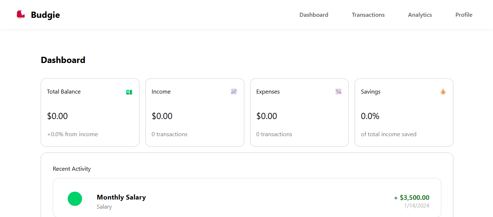

# 🛠️ Developer Guide: Budgie

Welcome, developer! This is the dev documentation for **Budgie** — a fun and friendly full-stack expense tracker built with Angular, Node.js, Prisma, and Docker.



---

## 📁 Folder Structure
```
budgie/
├── backend/ # NestJS backend
├── frontend/ # Angular frontend
├── docker/ # Docker-related files
└── docker-compose.yml
```

## 🌟 Core Features

- 🔐 User authentication with JWT
- ➕ Add/edit/delete transactions
- 📁 Categorize transactions
- 📊 Summaries for balance, income, expenses
- 📈 (Optional) Charts for visual feedback

---

## 📦 API Endpoints

### User
- `POST   /api/users/register` - Register a new user
- `POST   /api/users/login` - User login (returns JWT)
- `GET    /api/users/:id` - Get user by ID
- `PUT    /api/users/:id` - Update user details
- `DELETE /api/users/:id` - Delete a user
- `GET    /api/users/:id/summary` - Get user summary (total balance, income, expenses)
- `GET    /api/users/:id/categories` - Get all categories for a user
- `GET    /api/users/:id/transactions` - Get all transactions for a user


### Category
- `GET    /api/categories` - Get all categories
- `POST   /api/categories` - Create a new category
- `GET    /api/categories/:id` - Get category by ID
- `PUT    /api/categories/:id` - Update a category
- `DELETE /api/categories/:id` - Delete a category

### Transaction
- `GET    /api/transactions` - Get all transactions (optionally filter by user/category/type/date)
- `POST   /api/transactions` - Create a new transaction
- `GET    /api/transactions/:id` - Get transaction by ID
- `PUT    /api/transactions/:id` - Update a transaction
- `DELETE /api/transactions/:id` - Delete a transaction
- `GET    /api/transactions/:id/summary` - Get transaction summary by ID

---

## 🔧 Development Setup

### Backend

```bash
cd backend
npm install
npx prisma generate
npx prisma migrate dev --name init
npm run dev
```

### Frontend

```bash
cd frontend
npm install
ng serve
```

### Docker
```bash
docker-compose up --build
```

### Services
- db: PostgreSQL database
- backend: Express + Prisma API
- frontend: Angular app

### Environment Variables
Create a .env file in /backend with the following:

``` bash
DATABASE_URL=postgresql://user:password@db:5432/budgiedb
JWT_SECRET=your_jwt_secret
```